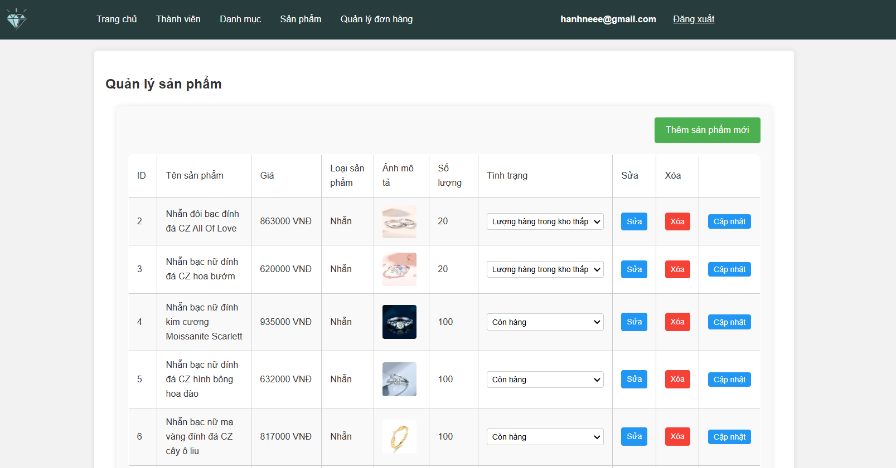

# Jewelry Store

Website bán trang sức trực tuyến với giao diện hiện đại, chức năng giỏ hàng, đặt hàng và quản lý sản phẩm.

## Tác giả
- Võ Minh Hạnh

- Email: hanhminhvo1809@gmail.com

## Mô tả dự án

Jewelry Store là một website thương mại điện tử đơn giản, phục vụ việc trưng bày và bán các sản phẩm trang sức như nhẫn, vòng cổ, hoa tai,...  
Người dùng có thể xem,tìm kiếm sản phẩm, thêm vào giỏ hàng, đặt hàng, và xem lịch sử đơn hàng.

## Tính năng nổi bật
- Xem danh sách và chi tiết sản phẩm
- Thêm sản phẩm vào giỏ hàng
- Mua ngay (Buy Now)
- Lưu thông tin đơn hàng và người mua
- Trang quản lý thành viên và sản phẩm
- Hệ thống bình luận cho từng sản phẩm
- Thông báo khi vượt quá số lượng tồn kho
- Lưu lịch sử đơn hàng qua số điện thoại

## Công nghệ sử dụng

- Ngôn ngữ: PHP, HTML, CSS, JavaScript
- Cơ sở dữ liệu: MySQL
- Môi trường phát triển: XAMPP (Apache + MySQL)
- Quản lý phiên: PHP Session

## Cài đặt

- Tải XAMPP và khởi động Apache + MySQL
- Clone dự án về thư mục `htdocs`
- Import database 'demodb.sql' in phpMyAdmin

## Hình ảnh sản phẩm

### Trang chủ:

### Chi tiết sản phẩm:

### Giỏ hàng:

### Admin

